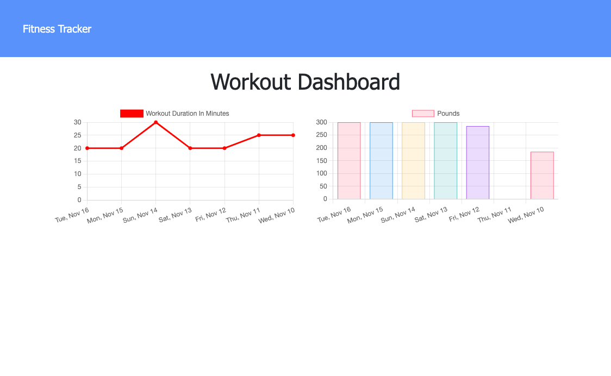
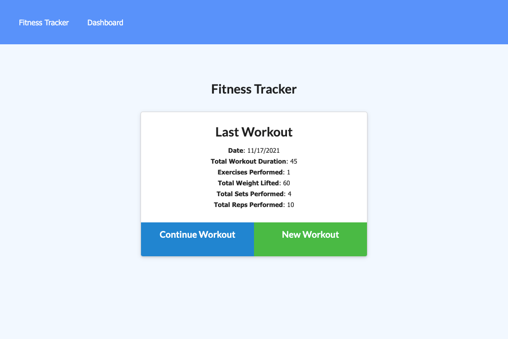

# Fitness-Tracker

## Description
This application was designed to help users  reach their fitness goals more quickly when they track their workout progress.

## Table of contents
  - [Installation](#installation)
  - [Usage](#usage)
  - [Credits](#credits)
  - [License](#license)
  - [Test](#test)
  - [Questions](#questions)
  

## Installation
Heroku URL link  : ******  

  
  

## Usage
As a user you will be able to:  
Add exercises to your most recent workout plan, add new exercises to a new workout plan. You will be able to view the combined weight of multiple exercises from the past seven workouts on the stats page. Finally, you will be able to view the total duration of each workout from the past seven workouts on the stats page.

## Credits
Received help from:  
Jayla De'nae - peer  
Nikki Dodge - peer  

This application uses:  
Mongoose  
MongoDB   
Express.js   

## License

## Contributions
n/a
## Test
n/a
## Questions
Github: Ismeny Saguilan - https://github.com/Ismeny  
Email: menysag2@gmail.com